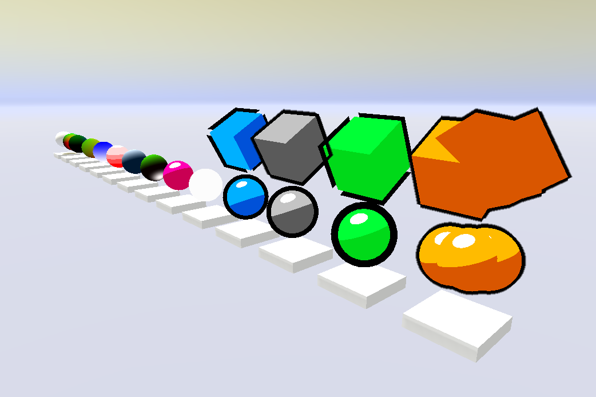

# unity-shader-lab
Unity shader example with Legacy render pipeline

## Preview

## Requirements
Using Unity 2020.3.29f1

## WIP
- Transparency
- SrollingTexture
- ScrollingTextureCutout
- DisapearingCow
- TwoToneDissolve
- VertexDisplacement

// ScreenSpace
- EdgeDetection

## References
- [Adrian Miasik/unity-shaders](https://github.com/adrian-miasik/unity-shaders)  
